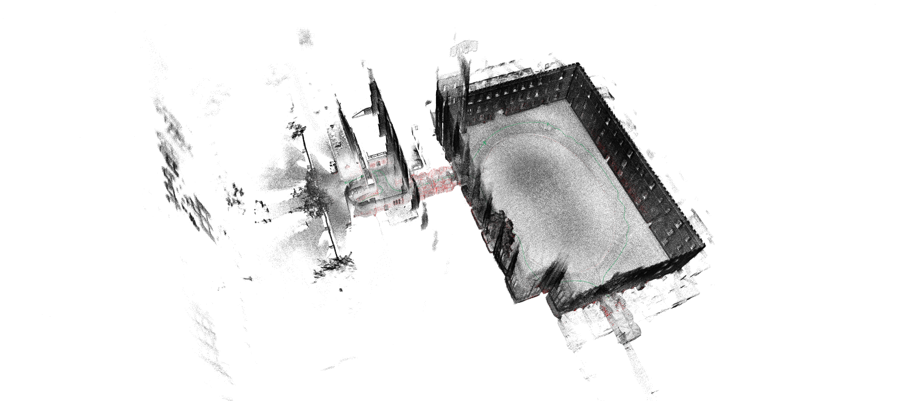
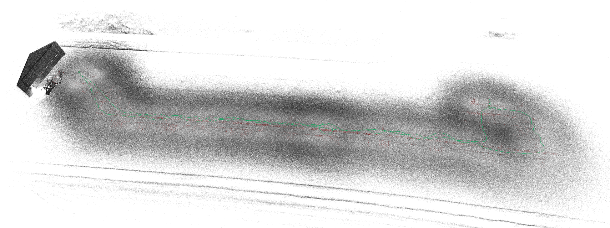
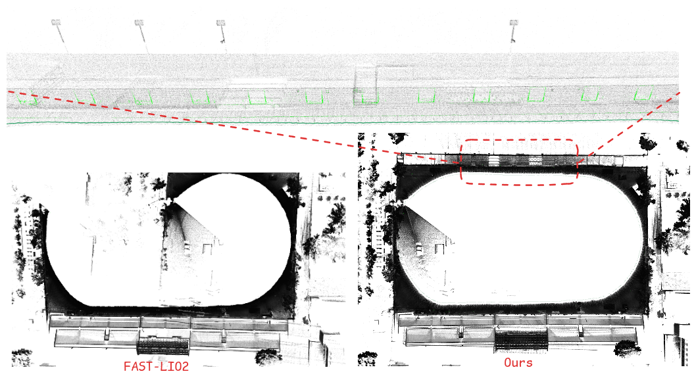

# IF-LIO
## IF-LIO: Intensity-Enhanced Front-End Matching for Robust LiDAR–Inertial Odometry under Geometric Degeneracy

### Introduction
IF-LIO is a degeneration-aware intensity-assisted LiDAR-SLAM framework that improves localization robustness in geometrically degenerate environments by selectively leveraging intensity information as complementary constraints.


### 1 Build
```bash
cd <your workspace>
mkdir src
cd src
git clone https://github.com/usersky-cmyk/IF-LIO.git
cd ..
catkin_make
```

### 2 Run
#### 2.1 Newer College Dataset
Download Newer College Dataset from https://ori-drs.github.io/newer-college-dataset/
```bash
source devel/setup.bash
roslaunch if_lio Newer_college.launch
```
#### 2.2 ENWIDE Dataset
Download ENWIDE Dataset from https://projects.asl.ethz.ch/datasets/enwide/
```bash
source devel/setup.bash
roslaunch if_lio ENWIDE.launch
```

#### 2.3 Self-collected Dataset
Download Self-collected Dataset from https://pan.baidu.com/s/1O7TMEtp_MsC5haGQPSLjsw (password: 1234)
```bash
source devel/setup.bash
roslaunch if_lio avia.launch
```


### 3 Result
#### 3.1 Newer College Dataset 
| Method (Length m) | Quad-Hard (234.81) | Cloister (428.79) | Stairs (57.04) | Park (2396.20) |
|------------------|-------------------|-------------------|----------------|----------------|
| [LIO-SAM](https://github.com/TixiaoShan/LIO-SAM) | 0.299 | 0.145 | × | 1.566 |
| [FAST-LIO2](https://github.com/hku-mars/FAST_LIO) | 0.049 | 0.078 | × | 0.310 |
| [RI-LIO](https://github.com/RoboFeng/RI-LIO) | 0.237 | 0.285 | × | 89.289 |
| [COIN-LIO](https://github.com/ethz-asl/COIN-LIO) | 0.046 | 0.078 | 0.102 | 0.287 |
| [PG-LIO](https://github.com/ntnu-arl/mimosa) | 0.054 | 0.097 | **0.077** | 0.331 |
| **Ours** | **0.045** | **0.067** | 0.092 | **0.241** |
##### quad-hard


#### 3.2 ENWIDE Dataset 
##### runway_d


#### 3.3 self-collected Dataset
##### playground



### 4 Acknowledgements
Thanks for the below great open-source project for providing references to this work.
- [FAST-LIO](https://github.com/hku-mars/FAST_LIO)
- [btsa](https://github.com/thisparticle/btsa)
- [RMS](https://github.com/ctu-mrs/RMS)
- [PV-LIO](https://github.com/HViktorTsoi/PV-LIO)

