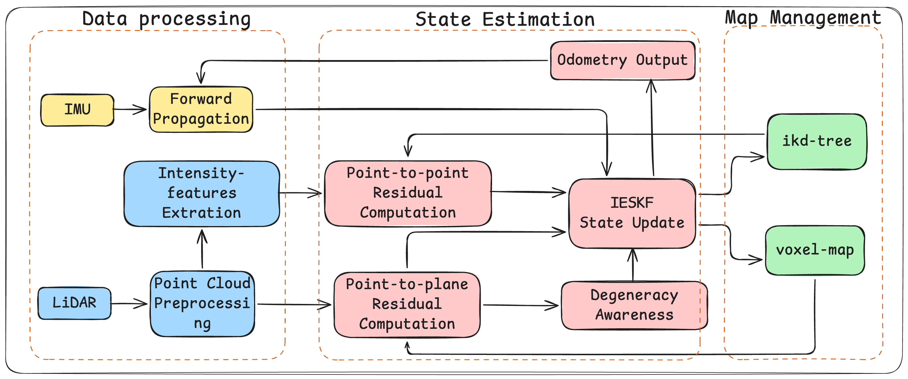

# IF-LIO
## IF-LIO: Intensity-Enhanced Front-End Matching for Robust LiDAR–Inertial Odometry under Geometric Degeneracy

### Introduction
IF-LIO is a degeneration-aware intensity-assisted LiDAR-SLAM framework that improves localization robustness in geometrically degenerate environments by selectively leveraging intensity information as complementary constraints.



### 1 Build
```bash
cd <your workspace>
mkdir src
cd src
git clone https://github.com/usersky-cmyk/IF-LIO.git
cd ..
catkin_make
```

### 2 Run
#### 2.1Newer College Dataset
Download Newer College Dataset from https://ori-drs.github.io/newer-college-dataset/
```bash
source devel/setup.bash
roslaunch if_lio Newer_college.launch
```

### 3 Mapping Result
